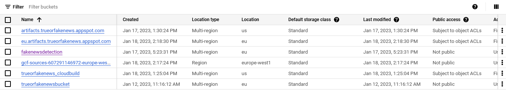
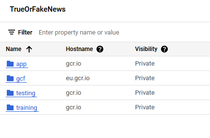
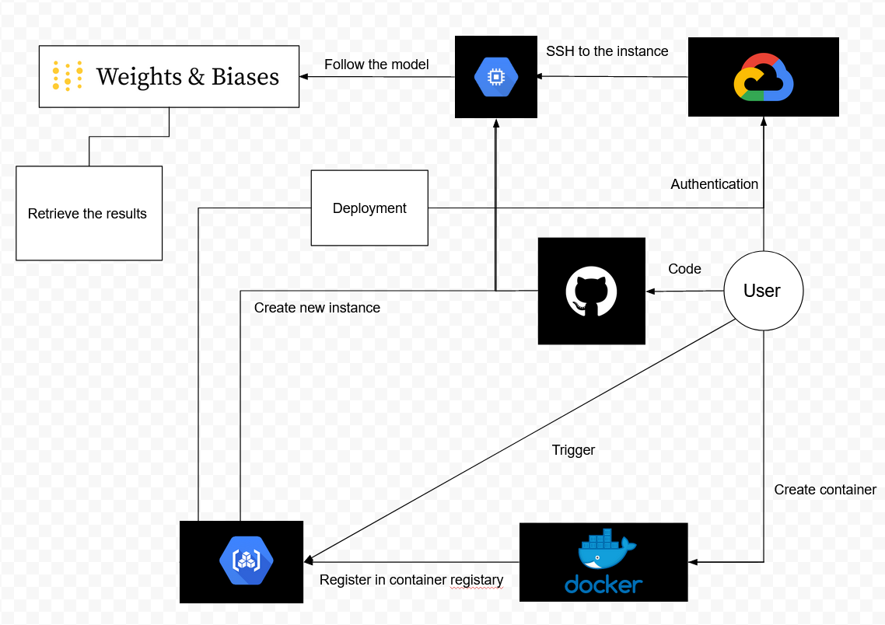

# Exam template for 02476 Machine Learning Operations

This is the report template for the exam. Please only remove the text formatted as with three dashes in front and behind
like:

```--- question 1 fill here ---```

where you instead should add your answers. Any other changes may have unwanted consequences when your report is auto
generated in the end of the course. For questions where you are asked to include images, start by adding the image to
the `figures` subfolder (please only use `.png`, `.jpg` or `.jpeg`) and then add the following code in your answer:

```markdown

```

In addition to this markdown file, we also provide the `report.py` script that provides two utility functions:

Running:

```bash
python report.py html
```

will generate an `.html` page of your report. After deadline for answering this template, we will autoscrape
everything in this `reports` folder and then use this utility to generate an `.html` page that will be your serve
as your final handin.

Running

```bash
python report.py check
```

will check your answers in this template against the constrains listed for each question e.g. is your answer too
short, too long, have you included an image when asked to.

For both functions to work it is important that you do not rename anything. The script have two dependencies that can
be installed with `pip install click markdown`.

## Group information

### Question 1
> **Enter the group number you signed up on <learn.inside.dtu.dk>**
>
> Answer:

*11*

### Question 2
> **Enter the study number for each member in the group**
>
> Example:
>
> *sXXXXXX, sXXXXXX, sXXXXXX*
>
> Answer:

*s203294, s204075, s200431, s204158*

### Question 3
> **What framework did you choose to work with and did it help you complete the project?**
>
> Answer length: 100-200 words.
>
> Example:
> *We used the third-party framework ... in our project. We used functionality ... and functionality ... from the*
> *package to do ... and ... in our project*.
>
> Answer:

We chose to work with the open-source Transformers framework from the Hugging Face organization. We chose to do so, because the framework includes a number of pretrained models for text classification, which we planned to utilize to achieve the goal of the project. For this purpose, we chose the RoBERTa model, since it has been shown to perform well on a variety of NLP tasks. Moreover, since we chose the RoBERTa model, we also utilized the RobertaTokenizer in order to prepare the inputs for the model in the make_dataset.py file. Finally, we chose the Adam optimizer, also imported from the transformers framework, as the optimizer for training (fine tuning) the model. 

## Coding environment

> In the following section we are interested in learning more about you local development environment.

### Question 4

> **Explain how you managed dependencies in your project? Explain the process a new team member would have to go**
> **through to get an exact copy of your environment.**
>
> Answer length: 100-200 words
>
> Example:
> *We used ... for managing our dependencies. The list of dependencies was auto-generated using ... . To get a*
> *complete copy of our development enviroment, one would have to run the following commands*
>
> Answer:

For dependency management, we used a requirements.txt file. This file includes all the manually added dependencies needed for the project as well as auto-generated dependencies found by the setuptools package "setup". To install the dependencies, one would run the command:

```pip install -r requirements.txt```

Furthermore, to run the unittests written for the project locally, one would run the command:

```pip install -r requirements_tests.txt```

### Question 5

> **We expect that you initialized your project using the cookiecutter template. Explain the overall structure of your**
> **code. Did you fill out every folder or only a subset?**
>
> Answer length: 100-200 words
>
> Example:
> *From the cookiecutter template we have filled out the ... , ... and ... folder. We have removed the ... folder*
> *because we did not use any ... in our project. We have added an ... folder that contains ... for running our*
> *experiments.*
> Answer:

> We held all of the folders generated by cookiecutter since we found them relevant. However, the ones we ended up filling were mainly src/data src/models and data. These folders contains all the source code for our data cleanup and generation as well as model training and evaluation. We ended up adding a lot of extra files to the root directory which is mostly .yaml files for configuring cloud runs as well as dockerfiles to build both the training image as well as the application image for deployment. It's worth noting that data is generated by a make file. We also added an ‘outputs’ folder which contains the hydra outputs with hyperparameters from our model runs.

### Question 6

> **Did you implement any rules for code quality and format? Additionally, explain with your own words why these**
> **concepts matters in larger projects.**
>
> Answer length: 50-100 words.
>
> Answer:

We did not attempt to systematically standardize the code, however we did follow our intuition in writing aesthetically. We do however strongly believe in code quality, and the reason we did not emphasize it in our project is perhaps being in a rush to work with other important exercises. However, as one of the last parts of cleaning up our project ,we ran some code formatting on our essential files to make sure that they comply with good coding practices.


## Version control

> In the following section we are interested in how version control was used in your project during development to
> corporate and increase the quality of your code.

### Question 7

> **How many tests did you implement?**
>
> Answer:

--- question 7 fill here ---

### Question 8

> **What is the total code coverage (in percentage) of your code? If you code had an code coverage of 100% (or close**
> **to), would you still trust it to be error free? Explain you reasoning.**
>
> **Answer length: 100-200 words.**
>
> Example:
> *The total code coverage of code is X%, which includes all our source code. We are far from 100% coverage of our **
> *code and even if we were then...*
>
> Answer:

--- question 8 fill here ---

### Question 9

> **Did you workflow include using branches and pull requests? If yes, explain how. If not, explain how branches and**
> **pull request can help improve version control.**
>
> Answer length: 100-200 words.
>
> Example:
> *We made use of both branches and PRs in our project. In our group, each member had an branch that they worked on in*
> *addition to the main branch. To merge code we ...*
>
> Answer: 

We utilized branches in our project – each member had a separate branch and different  exercises they were assigned to finish. By doing so, we secured that as we coded our individual problems didn’t affect the other group members. Naturally, we had to use push and pull request to update our individual branches, and finally  merge to create the complete dictionary on the main branch. As with all projects which utilize git, we were met with a plethora of merge conflicts – to solve this,  we used the VS code extension “Git Graph” to keep track of the development of the individual branches. This helped us understand the value which git hold (and hereby the usage of branches), and without it, we doubt a final project could have emerged. 

### Question 10

> **Did you use DVC for managing data in your project? If yes, then how did it improve your project to have version**
> **control of your data. If no, explain a case where it would be beneficial to have version control of your data.**
>
> Answer length: 100-200 words.
>
> Example:
> *We did make use of DVC in the following way: ... . In the end it helped us in ... for controlling ... part of our*
> *pipeline*
>
> Answer:
>

We did use DVC to upload the data to the cloud, however we had a lot of problems with it, which was due to the fact that we used different accounts to get on Gcloud running. In some of the experiments we uploaded the data manually so as to test if the models would train in the cloud. Essentially, we kept getting unknown errors when trying to pull the data from dvc and with very little logging from dvc, it was hard to actually resolve the issues. We got it working locally, however when we ran our models in the cloud as well as in cloud deployment, we ended up pulling data directly from our google cloud bucket assigned to the project.

### Question 11

> **Discuss you continues integration setup. What kind of CI are you running (unittesting, linting, etc.)? Do you test**
> **multiple operating systems, python version etc. Do you make use of caching? Feel free to insert a link to one of**
> **your github actions workflow.**
>
> Answer length: 200-300 words.
>
> Example:
> *We have organized our CI into 3 separate files: one for doing ..., one for running ... testing and one for running*
> *... . In particular for our ..., we used ... .An example of a triggered workflow can be seen here: <weblink>*
>
> Answer:

--- question 11 fill here ---

## Running code and tracking experiments

> In the following section we are interested in learning more about the experimental setup for running your code and
> especially the reproducibility of your experiments.

### Question 12

> **How did you configure experiments? Did you make use of config files? Explain with coding examples of how you would**
> **run a experiment.**
>
> Answer length: 50-100 words.
>
> Example:
> *We used a simple argparser, that worked in the following way: python my_script.py --lr 1e-3 --batch_size 25*
>
> Answer:

We had a single hydra file in src/models/config with a single experiment. The scripts can be executed using src/file_script/script_name. We configured the hyperparameters for the training run of the model so that we could access them later and document them. The project does however lack an argparser system, which we found redundant since we could set the hyperparameters with the hydra package.

### Question 13

> **Reproducibility of experiments are important. Related to the last question, how did you secure that no information**
> **is lost when running experiments and that your experiments are reproducible?**
>
> Answer length: 100-200 words.
>
> Example:
> *We made use of config files. Whenever an experiment is run the following happens: ... . To reproduce an experiment*
> *one would have to do ...*
>
> Answer:

When running our experiments, we made use of hydra config file. Whenever we run an experiment, we would either change the hyperparameters in the default config file or add a new config file for a certain setting. Experiments are specified in the src/models/config/experiments folder, and in order to reproduce an experiment one should use the default experiment file. Experiments variables are then documented in the yaml files. To create a new experiment with a new run configuration, one would create a new run<run_number>.yaml file and set the hyperparameters as desired.

### Question 14

> **Upload 1 to 3 screenshots that show the experiments that you have done in W&B (or another experiment tracking**
> **service of your choice). This may include loss graphs, logged images, hyperparameter sweeps etc. You can take**
> **inspiration from [this figure](figures/wandb.png). Explain what metrics you are tracking and why they are**
> **important.**
>
> Answer length: 200-300 words + 1 to 3 screenshots.
>
> Example:
> *As seen in the first image when have tracked ... and ... which both inform us about ... in our experiments.*
> *As seen in the second image we are also tracking ... and ...*
>
> Answer:
We used Weights and biases to track both our training and test process (regarding the model). Additionally, the system was tracked - referring to process memory, disk utilization and network trafficking. 
In the first image, you can see the evaluation of our model. 
 
This shows (see the light blue line) that our accuracy grew as our loss fell (quite naturally). Furthermore, we see that the accuracy is starting to flatten ou 

--- question 14 fill here ---

### Question 15

> **Docker is an important tool for creating containerized applications. Explain how you used docker in your**
> **experiments? Include how you would run your docker images and include a link to one of your docker files.**
>
> Answer length: 100-200 words.
>
> Example:
> *For our project we developed several images: one for training, inference and deployment. For example to run the*
> *training docker image: `docker run trainer:latest lr=1e-3 batch_size=64`. Link to docker file: <weblink>*
>
> Answer:
> 

>We have developed two docker files. One for training and the other for deployment and >inference. 
>To run the training docker image one should run "docker run training.Dockerfile". 
>The command is "docker run app.Dockerfile" for the other file. 

### Question 16

> **When running into bugs while trying to run your experiments, how did you perform debugging? Additionally, did you**
> **try to profile your code or do you think it is already perfect?**
>
> Answer length: 100-200 words.
>
> Example:
> *Debugging method was dependent on group member. Some just used ... and others used ... . We did a single profiling*
> *run of our main code at some point that showed ...*
>
> Answer:
> 

Debugging method was dependent on group member. Some just used VS code's python debugger while others used pycharms debugger. (NEED MORE)

## Working in the cloud

> In the following section we would like to know more about your experience when developing in the cloud.

### Question 17

> **List all the GCP services that you made use of in your project and shortly explain what each service does?**
>
> Answer length: 50-200 words.
>
> Example:
> *We used the following two services: Engine and Bucket. Engine is used for... and Bucket is used for...*
>
> Answer:
>

Compute engine: Here, we created virtual machine instances for computational purposes. We mainly used this for trying to run the training scripts as the transformer model was too large to run properly on our local pc’s. 
Vertex AI: Used for automatically setting up training jobs and executing them directly in the cloud using cloud resources. However, we used this very little and only experimentally as we had issues with our training docker files. The issues mainly rose from us not being able to accurately pull the dataset using dvc. Another issue here were, that two of the group members used an AMD chip, which caused the docker images to be non-compliant with the ARM-based system that Vertex AI runs on.
Cloud storage: Used for storing larger files in the cloud. We used this for storing our processed dataset to make it available to use in our training as well as storing the trained model checkpoint. The model checkpoint would then be loading into cloud run for deployment
Container registry: Used for storing the containers used in the project. Here, we had the built docker containers for running both the application as well as the container for training our model.

### Question 18

> **The backbone of GCP is the Compute engine. Explained how you made use of this service and what type of VMs**
> **you used?**
>
> Answer length: 50-100 words.
>
> Example:
> *We used the compute engine to run our ... . We used instances with the following hardware: ... and we started the*
> *using a custom container: ...*
>
> Answer:
> 

We used the compute engine to run our training scripts. We used cpu-instances using our custom container image and pytorch pre-installed. Unfortunately we missed access to the project where we would run our training script after the 50 dollars was used. We did not train the models on the compute engine, but we know that it's possible if the, but we could still work with cloud on the account that had $350 worth of credits. Instead we found a solution in letting the models run locally and then build a docker image from the local machine.

### Question 19

> **Insert 1-2 images of your GCP bucket, such that we can see what data you have stored in it.**
> **You can take inspiration from [this figure](figures/bucket.png).**
>
> Answer:



### Question 20

> **Upload one image of your GCP container registry, such that we can see the different images that you have stored.**
> **You can take inspiration from [this figure](figures/registry.png).**
>
> Answer:



### Question 21

> **Upload one image of your GCP cloud build history, so we can see the history of the images that have been build in**
> **your project. You can take inspiration from [this figure](figures/build.png).**
>
> Answer:


### Question 22

> **Did you manage to deploy your model, either in locally or cloud? If not, describe why. If yes, describe how and**
> **preferably how you invoke your deployed service?**
>
> Answer length: 100-200 words.
>
> Example:
> *For deployment we wrapped our model into application using ... . We first tried locally serving the model, which*
> *worked. Afterwards we deployed it in the cloud, using ... . To invoke the service an user would call*
> *`curl -X POST -F "file=@file.json"<weburl>`*
>
> Answer:

First, we deployed our model locally using FastAPI. This worked great and the API would guide the user to input a text promt and then do inference based on that. Then, we tried to deploy it using google cloud, but we again ran into problems pulling the correct checkpoint for the inference model. Instead, we built the docker file locally and pushed it to the container registry, which then served as the image that the cloud run serve ran. While the cloud run was successfully able to access our application from the image, we found out that it was the wrong image with the old API, which therefore did not include the guiding to the text promt and we could not do inference using it, even though it should work. 
\
To invoke the service locally, one would call
```curl -X 'POST' \
  'http://127.0.0.1:8000/predict_if_fake_news/?text_message=@text_message.json\
  -H 'accept: application/json' \
  -d ''
```
In order to invoke the service served on cloud run, one would access the hyperlink <https://app-lj4fkog2eq-ew.a.run.app>

### Question 23

> **Did you manage to implement monitoring of your deployed model? If yes, explain how it works. If not, explain how**
> **monitoring would help the longevity of your application.**
>
> Answer length: 100-200 words.
>
> Example:
> *We did not manage to implement monitoring. We would like to have monitoring implemented such that over time we could*
> *measure ... and ... that would inform us about this ... behaviour of our application.*
>
> Answer:

--- question 23 fill here ---

### Question 24

> **How many credits did you end up using during the project and what service was most expensive?**
>
> Answer length: 25-100 words.
>
> Example:
> *Group member 1 used ..., Group member 2 used ..., in total ... credits was spend during development. The service*
> *costing the most was ... due to ...*
>
> Answer:
> 

s204075 (Magnus) still has 100 dollars from his 350 dollar budget. s204158 (Arian) used all of his 50 dollars. A lot of the money spent was used on the old mlops project from the exercises. In total, the Fake News Detection project used around 60 kr in credits, where storage and compute was the most expensive services. However, it is hard to know exactly what cost a lot since google cloud did not log expenses which was paid for by credits.

## Overall discussion of project

> In the following section we would like you to think about the general structure of your project.

### Question 25

> **Include a figure that describes the overall architecture of your system and what services that you make use of.**
> **You can take inspiration from [this figure](figures/overview.png). Additionally in your own words, explain the**
> **overall steps in figure.**
>
> Answer length: 200-400 words
>
> Example:
> *
> *The starting point of the diagram is our local setup, where we integrated ... and ... and ... into our code.*
> *Whenever we commit code and puch to github, it auto triggers ... and ... . From there the diagram shows ...*
>
> Answer:
> 
> The starting point of the diagram is the user which can directly authenticate
> into the cloud, ssh into a given instance, and train the model. The user can
> then follow their progress through weights and biases and retrieve the data
> from either the cloud or WaB. 
> The user can also push their own code to github and the respective container to
> the cloud. This can be done the fast way using a trigger or manually. 
> A new instance can then be created from the costume container so as to be used
> for training. 
> The container can also be used for deployment after its creation is triggered. 

--- question 25 fill here ---

### Question 26

> **Discuss the overall struggles of the project. Where did you spend most time and what did you do to overcome these**
> **challenges?**
>
> Answer length: 200-400 words.
>
> Example:
> *The biggest challenges in the project was using ... tool to do ... . The reason for this was ...*
>
> Answer:
> 

Cloud computing was certainly a part of the project that took an overwhelming amount of time. We used a lot of time trying to figure out why the docker build was failing and why we could not find the appropriate data anywhere. The costs also put an early stop to our project, when we could not access it anymore, forcing us to use another account and set it up again.
\
We had so many issues with dvc, where it would remove our data from our local machines never to be seen again, forcing us to create and process the dataset again. 
\
Another issue was our inexperience with git. We has trouble with our branches, pull requests and merges as files would change, lose functionality or even disappear at some times, making us have to spend several hours to regain what was lost. 
\
We were also challenged with the different computer architectures within the group. Two of us were using Mac/Linux operating systems with the AMD-based chips and the others were using Windows operating systems with the ARM-based chips. This caused a lot of our internal files to be non-compliant and essentially ended up ruining a lot of our work on the docker files. These docker files also ended up being huge and took very long time (>30 mins) to push to the cloud, making a deployment pipeline very slow.

### Question 27

> **State the individual contributions of each team member. This is required information from DTU, because we need to**
> **make sure all members contributed actively to the project**
>
> Answer length: 50-200 words.
>
> Example:
> *Student sXXXXXX was in charge of developing of setting up the initial cookie cutter project and developing of the*
> *docker containers for training our applications.*
> *Student sXXXXXX was in charge of training our models in the cloud and deploying them afterwards.*
> *All members contributed to code by...*
>
> Answer:
> 

s204158(Arian) worked with getting the scripts related to generating the data. He also attempted to get the model training on the gcloud using our costume container. <TO BE CONTINUED> 

